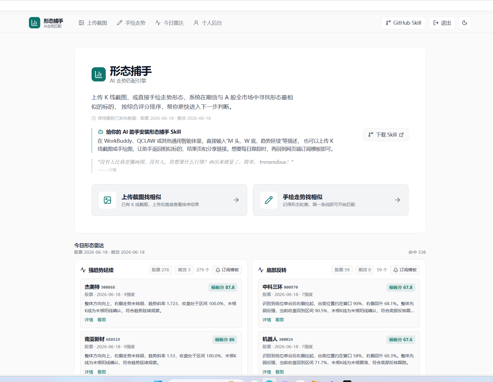
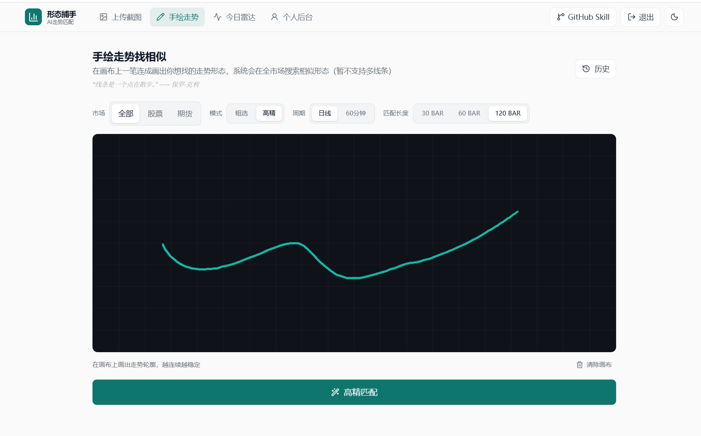
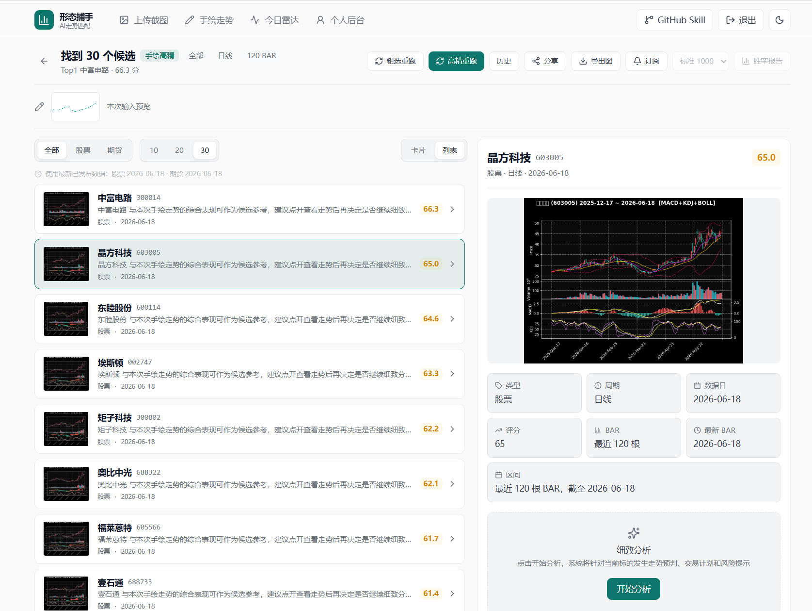
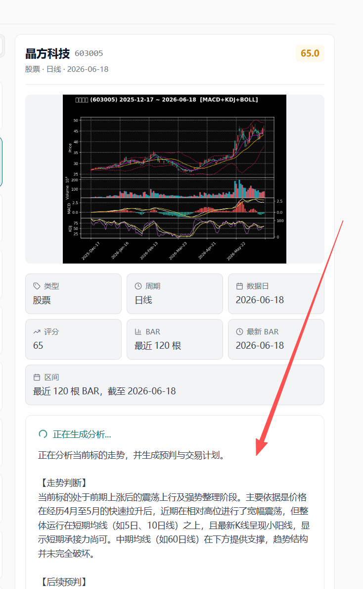

# 形态捕手 Skill

把这个仓库地址发给你的 AI，它就可以帮你用文字描述、K 线截图、手绘走势图，查找相似的 A 股或期货形态，并返回候选标的、评分、结果页和分享页。

结果仅用于形态相似度研究和选股辅助，不构成投资建议。

```text
https://github.com/quantskills/skill-xingtai-catcher
```

## 你可以怎么说

文字搜索：

```text
帮我找 A 股里类似 W 底右侧抬升的股票，日线，120 BAR，返回 Top5。
```

手绘图搜索：

```text
用这张手绘走势图帮我找相似形态，优先看股票，日线，120 BAR。
```

K 线截图搜索：

```text
用这张 K 线截图帮我找相似走势，全市场，60分钟，60 BAR。
```

固定模板筛选：

```text
帮我看今天的强趋势延续。
帮我看今天的底部反转。
帮我找 W 底 / 双底。
帮我看趋势回踩和震荡整理。
```

这些固定模板会直接走服务器的“今日形态雷达”，不会让 AI 临时画一张图再搜索，所以结果更稳定，也更适合每天跟踪。

如果你没有说明周期和 BAR 长度，AI 应该先问你：

```text
你想按哪个周期和长度匹配？可以选：日线 120 BAR、日线 60 BAR、60分钟 120 BAR、60分钟 60 BAR。你也可以说“默认”，我就用日线 120 BAR。
```

## 图片搜索规则

如果你上传了图片，AI 应该直接把原图交给形态捕手匹配：

- 手绘图、单线走势图、画布截图：使用 `kind=drawing`，并默认 `mode=high_precision`。
- 真实 K 线蜡烛图截图：使用 `kind=upload_screenshot`。
- 不要让 AI 先把图片改写成文字。
- 不要让 AI 重新画一张图再搜索。
- 如果 AI 不确定图片类型，它应该先问你“这是手绘走势图，还是 K 线截图？”

真实 K 线截图如果识别失败，通常是图表裁剪不够清楚。请尽量只保留 K 线主图和指标区，减少网页按钮、聊天窗口、边框和空白区域。只有确认图片本来就是手绘/单线图时，才应该改成手绘模式重试。

## 产品效果

### 首页和今日形态雷达

首页展示最新数据日期、固定模板雷达，以及 Skill 下载入口。固定模板适合“不想画图，直接看机会”的用户。



### 手绘走势找相似

你可以直接画一条走势轮廓，选择市场、模式、周期和匹配长度，然后让系统在全市场里寻找相似形态。



### 结果页和候选列表

结果页会展示候选列表、输入预览、标的 K 线图、评分、数据日、周期和 BAR 长度。你可以继续分享、订阅或导出图片。



### 大模型分析

点击分析后，系统会结合当前 K 线图、指标结构和模板背景，生成走势判断、后续预判、交易计划和风险提示。



### 个人后台和订阅

登录网站后，可以保存形态、订阅模板，设置每日推送时间，并通过飞书或企业微信接收最新结果。


## 能力边界

- 文字模板：强趋势延续、底部反转、W底/双底、趋势回踩、震荡整理、M头/顶部反转。
- 手绘走势：适合表达轮廓，例如 W 底、M 头、趋势延续、震荡后上行、下跌后反转。
- K 线截图：适合已有股票或期货的图表截图，系统会识别蜡烛结构后匹配。
- 周期：日线、60分钟。
- 匹配长度：30 BAR、60 BAR、120 BAR。
- 市场：A 股、期货、全市场。

## 手绘 W 底和 M 头的小技巧

画 W 底时，建议先画一段前置下跌，再画第一个底、反弹、第二个底和右侧抬升。只画最后一个 W，容易丢失“底部反转”的上下文。

画 M 头时，建议先画一段前置上涨，再画第一个顶、回落、第二个顶和右侧走弱。只画最后一个 M，容易和普通震荡混在一起。

## 直连脚本

一般用户只需要把仓库交给 AI，不需要自己运行命令。如果你的 AI 需要明确命令，可以使用仓库里的直连脚本。

AI 调用脚本后应读取 `.xingtai_result.txt`，再把结果整理给用户。

文字搜索：

```bash
python scripts/xingtai_search.py text "找底部反转" --universe all --timeframe 1d --window-bars 120 --top-n 5
```

手绘图搜索：

```bash
python scripts/xingtai_search.py image --image-path ./drawing.png --kind drawing --mode high_precision --universe all --timeframe 1d --window-bars 120 --top-n 5
```

K 线截图搜索：

```bash
python scripts/xingtai_search.py image --image-path ./chart.png --kind upload_screenshot --universe all --timeframe 1d --window-bars 120 --top-n 5
```

如果 K 线截图识别失败，而你确认它其实是手绘/单线图，才使用：

```bash
python scripts/xingtai_search.py image --image-path ./chart.png --kind upload_screenshot --retry-as-drawing --universe all --timeframe 1d --window-bars 120 --top-n 5
```

调试时想在终端直接打印结果，可以加 `--print`。

## 使用限制

- `top_n` 最大为 10。
- 图片建议压缩后再上传，默认最大 2MB。
- 公共试用服务有频率限制，短时间大量请求可能会排队或被拒绝。
- 服务返回的是形态相似候选，不保证未来收益。

## 仓库内容

```text
skill-xingtai-catcher/
  SKILL.md
  README.md
  LICENSE
  agents/openai.yaml
  references/mcp-usage.md
  scripts/xingtai_search.py
  assets/screenshots/
```

## Contributors

- 松鼠量化 / songshuquant：产品设计、形态捕手服务维护、PandaData 行情与网页端系统。
- OpenAI Codex：Skill 包整理、MCP 使用文档和发布校验协助。

## License

GPL-3.0
