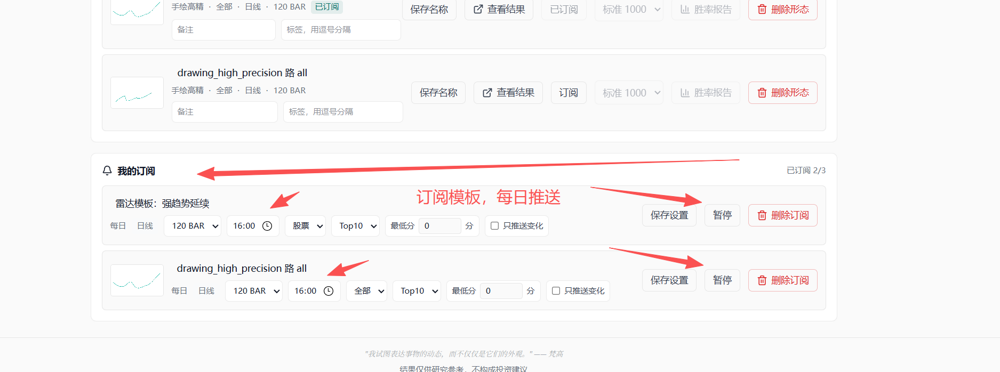

# 形态捕手 Skill

把这个仓库交给你的 AI，它就可以帮你用“文字描述、K 线截图、手绘走势”查找相似的 A 股或期货形态，并返回候选标的、评分、结果页和分享页。

结果只用于形态相似度研究和选股辅助，不构成投资建议。

## 你可以怎么用

把仓库地址发给你的 AI：

```text
https://github.com/quantskills/skill-xingtai-catcher
```

然后直接说需求，例如：

```text
帮我找 A 股里类似 W 底右侧抬升的股票，日线，120 BAR，返回 Top5。
```

也可以上传 K 线截图或手绘走势图，然后说：

```text
用这张图帮我找相似形态，优先看股票，日线，120 BAR。
```

如果你没有说明周期和数据长度，AI 应该先问你：

```text
你想按哪个周期和长度匹配？可以选：日线 120 BAR、日线 60 BAR、60分钟 120 BAR、60分钟 60 BAR。你也可以说“默认”，我就用日线 120 BAR。
```

## 产品效果

### 首页和今日形态雷达

网站首页会展示最新数据日期、固定模板雷达，以及 Skill 下载入口。固定模板适合“不想画图、直接看机会”的用户。


### 手绘走势找相似

你可以直接画一条走势轮廓，选择市场、模式、周期和匹配长度，然后让系统在全市场里寻找相似形态。


### 结果页和候选列表

结果页会返回候选标的、评分、数据日、K 线图、BAR 长度、结果页和分享页。AI 应该把这些整理成用户可读的摘要，而不是贴原始 JSON 或执行日志。


### 细致分析

在网页端可以对单个候选标的发起分析，查看走势判断、后续预判、交易计划和风险提示。


### 保存形态和每日订阅

登录网页端后，可以保存形态、订阅固定雷达模板或自定义形态，并设置每日推送时间、周期、BAR 长度、市场范围和 TopN。



## 支持的输入

- 文字描述：例如“找 W 底”“找 M 顶”“找强趋势延续”“找底部反转”。
- K 线截图：上传已有股票或期货的 K 线图，查找相似走势。
- 手绘走势：画出你想找的走势轮廓，系统按形态相似度匹配。
- 固定模板：强趋势延续、底部反转这类服务器模板可以直接筛选，不需要每次重新画图。

## 支持的参数

| 维度 | 支持值 | 建议 |
|---|---|---|
| 市场 | 全部、股票、期货 | 不确定时用全部 |
| 周期 | 日线、60分钟 | 波段默认日线，短线可用 60分钟 |
| 匹配长度 | 30 BAR、60 BAR、120 BAR | 默认 120 BAR，短窗口才用 30 BAR |
| 返回数量 | Top5、Top10 | 默认 Top5，最多 Top10 |

常见自然语言映射：

- “A 股”“股票” -> 股票
- “期货”“商品期货” -> 期货
- “日线”“波段”“最近半年” -> 日线 + 120 BAR
- “60分钟”“小时线”“短线” -> 60分钟
- “多给几个” -> Top10
- 只说“找 W 底”“找 M 顶”“找趋势”但没说周期和 BAR -> 先问用户，不直接搜索

## 手绘 W 底和 M 顶的小技巧

W 底、M 顶不要只画最后那个字母形态，要带一点前置行情：

- 画 W 底：先画一段下跌，再画第一个底、反弹、第二个底、右侧抬升。
- 画 M 顶：先画一段上涨，再画第一个顶、回落、第二个顶、右侧回落或破位。

这样系统更容易区分“底部反转/顶部反转”和普通震荡。

## AI 应该怎么返回

默认脚本会输出可直接给用户看的中文摘要。AI 不应该把 `System (untrusted)`、`Exec completed`、原始 JSON 或命令执行日志贴给用户。

推荐返回格式：

```text
我按「股票 / 日线 / 120 BAR / Top5」为你查找了相似形态。

候选结果
1. 标的名称 代码，评分 xx.x，股票，数据日 yyyy-mm-dd
2. ...

结果页：https://kkk.quant789.com/results/session_xxx
分享页：https://kkk.quant789.com/share/shr_xxx
订阅入口：https://kkk.quant789.com/results/session_xxx?intent=subscribe

想每天自动跟踪这个形态，请打开结果页登录形态捕手，保存形态或订阅模板，并设置飞书/企微推送。
结果仅用于形态相似度研究，不构成投资建议。
```

## 每日订阅怎么用

AI 负责帮用户完成“找相似形态”。如果用户想每天自动跟踪，需要回到网页端：

1. 打开 AI 返回的结果页。
2. 登录或注册形态捕手账号。
3. 保存当前形态，或订阅固定雷达模板。
4. 在个人后台配置飞书机器人或企业微信机器人。
5. 设置每日推送时间、周期、BAR 长度、市场范围和 TopN。

之后系统会根据最新数据生成相似结果，并按订阅设置推送。

## 直接运行脚本

大多数用户只需要把仓库交给 AI，不需要自己运行命令。如果你的 AI 需要明确命令，可以使用仓库里的直连脚本。

文字搜索：

```bash
python scripts/xingtai_search.py text "找 W底右侧抬升的 A 股" --universe stock --timeframe 1d --window-bars 120 --top-n 5
```

图片搜索：

```bash
python scripts/xingtai_search.py image --image-path ./chart.png --kind upload_screenshot --universe all --timeframe 1d --window-bars 120 --top-n 5
```

手绘图把 `--kind upload_screenshot` 改成 `--kind drawing`。

默认命令输出中文摘要。只有调试或二次集成时，才在命令最后加 `--json`。

## 可选：MCP 地址

这个仓库已经支持直连脚本，普通用户不需要手动配置 MCP。如果你的智能体平台本身支持 MCP，可以使用：

```json
{
  "mcpServers": {
    "xingtai-catcher": {
      "url": "https://kkk.quant789.com/mcp"
    }
  }
}
```

## 使用限制

- `top_n` 最大为 10。
- 图片建议清晰但压缩后上传。
- 公共试用服务有频率限制，短时间大量请求可能会排队或被拒绝。
- 服务返回的是形态相似候选，不保证未来收益。

## 仓库内容

```text
skill-xingtai-catcher/
  SKILL.md
  README.md
  LICENSE
  agents/openai.yaml
  references/mcp-usage.md
  scripts/xingtai_search.py
  assets/screenshots/
```

## Contributors

- 松鼠量化 / songshuquant：产品设计、形态捕手服务维护、PandaData 行情与网页端系统。
- OpenAI Codex：Skill 包整理、MCP 使用文档和发布校验协助。

## License

GPL-3.0
